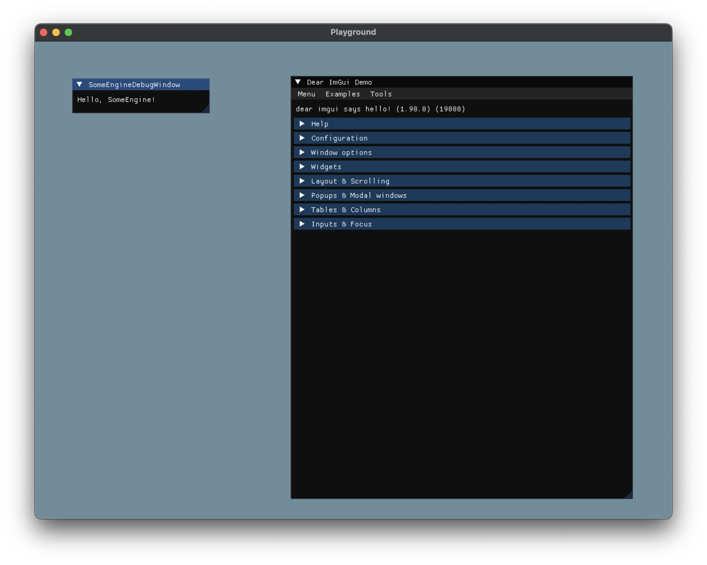

# GameEngineStarter Showcases

## Windows

## macOS

## Linux

> It's an example running on WSL2.

## Raspberry Pi

## Emscripten

> For showing logs, I decreased my window size.

## Android

> It's an example running on my POCO X5.