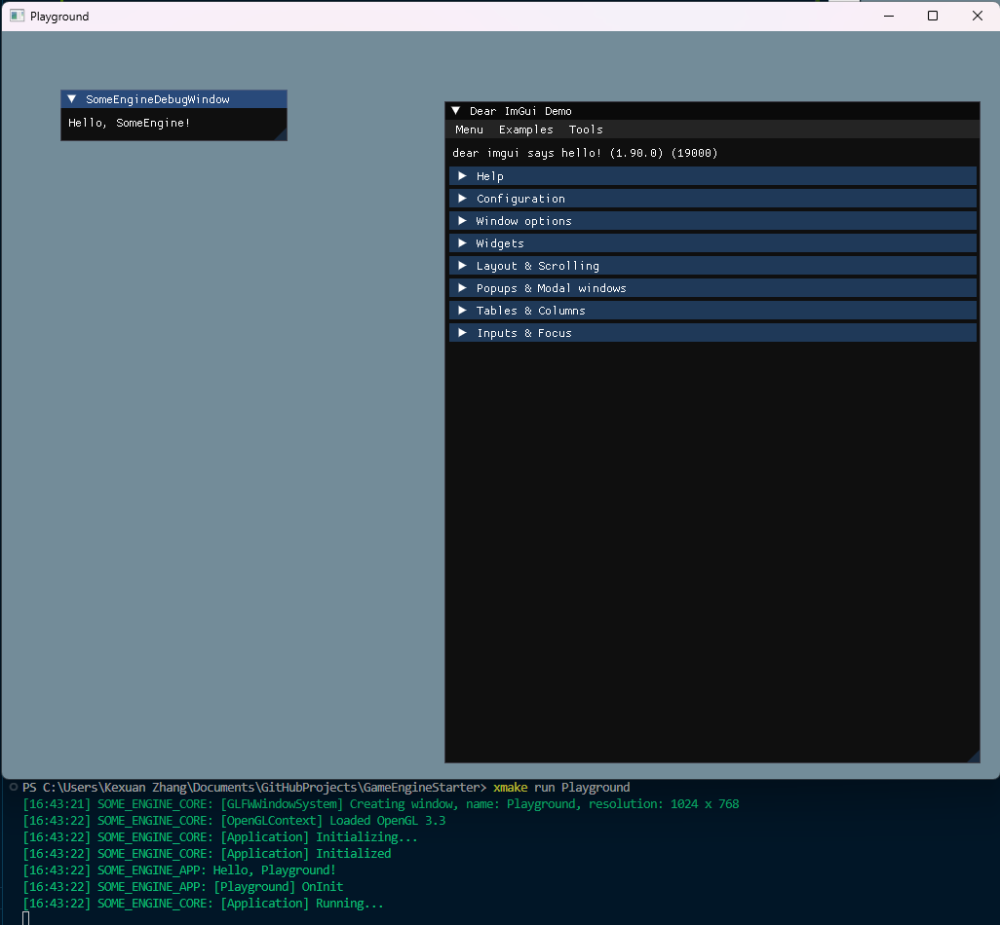

# GameEngineStarter

<h4 align="center">
  <strong>GameEngineStarter</strong> is a minimal C++ game engine starter project. 
</h4>

<p align="center">
    <a href="https://github.com/zzxzzk115/GameEngineStarter/actions" alt="CI-Windows">
        </a>
    <a href="https://github.com/zzxzzk115/GameEngineStarter/actions" alt="CI-Linux">
        </a>
    <a href="https://github.com/zzxzzk115/GameEngineStarter/actions" alt="CI-MacOS">
        </a>
    <a href="https://github.com/zzxzzk115/GameEngineStarter/issues" alt="GitHub Issues">
        
    </a>
    <a href="https://github.com/zzxzzk115/GameEngineStarter/blob/master/LICENSE" alt="GitHub">
        
    </a>
</p>

<div align="center">
  Have fun and for free use this template to make your game engine!
</div>

## Features

- **Cross-Platform**: Windows, macOS, Linux, ARM Linux (Raspberry Pi), Emscripten (WASM).
- **Minimal & Popular Dependencies**: Only spdlog, glad, imgui, glfw, sdl2.
- **Using XMake as Project Generator & Builder**: Combining the functionalities of various build tools, incorporating the speed of Ninja, and introducing customizable library repositories, results in a versatile and efficient build system.
- **Minimal system implemented:** A simple cross-platform window is implemented using either GLFW or SDL2 paired with OpenGL. This provides a fundamental GL/GLES context for basic graphics operations.



## Showcases

For more showcases, please visit [Media/Showcases](./Media/Showcases/README.md)

## Prerequisites

Ensure to globally replace instances of `SomeEngine` with the name of your game engine and replace `SOME_ENGINE` with the designated macro prefix for your game engine.

### Windows

- [XMake](https://github.com/xmake-io/xmake)
- Visual Studio 2019 (or above) with C++ Desktop Development Environment
- Git 2.1 (or above)

### macOS

- [XMake](https://github.com/xmake-io/xmake)
- XCode 13 (or above)
- Git 2.1 (or above)

To install XMake on macOS, you can use HomeBrew:

```bash
brew install xmake
```

### Linux

#### Ubuntu / Raspberry Pi OS / Other Debian Systems

To install XMake, simply use curl:

```bash
curl -fsSL https://xmake.io/shget.text | bash
```

Install other packages:

```bash
sudo apt-get install build-essential cmake git clang libx11-dev libxrandr-dev libxrender-dev libglvnd-dev libxinerama-dev libxcursor-dev libxi-dev
```

#### Other Linux Systems

TODO

### Emscripten

- Install Xmake as above.
- Install Emscripten by following official documentation.

## Build Engine

Clone this repo first:

```bash
git clone git@github.com:zzxzzk115/GameEngineStarter.git --recursive
```

### Build on Windows

In CMD or Powershell, at the project root directory, execute `xmake -v -y`.

Or simply double click `xmake_windows.bat`.

### Build on macOS / Linux

```bash
cd GameEngineStarter/
xmake -v -y
```

### Build for Emscripten

```bash
xmake f -p wasm
xmake -v -y
```

### Build Options

#### Window Option

Switch to SDL2:

```bash
xmake f --window=sdl2
xmake
```

Switch to GLFW:

```bash
xmake f --window=glfw
xmake
```
#### Clear configs

```bash
xmake f -c
```

## Run projects

Run all programs:

```bash
xmake run
```

Run a specific programe:

```bash
xmake run Playground
```

## Debug projects

For example, debug `Playground`:

```bash
xmake f -m debug # Switch to debug mode

# Switch to release mode:
# xmake f -m release

xmake run Playground
```

If you want to know more about XMake, please visit their [official document website](https://xmake.io/).

## FAQ

**Q:** Why not using CMake, Premake, Scons and other project generators or build systems?

**A:** CMake can be challenging to use. Premake and Scons offer easier alternatives, but they both lack a dedicated package manager. XMake, on the other hand, comes with its official repository serving as a cross-platform package manager. Additionally, it allows you to fork it and implement your own package manager. Leveraging XMake makes managing dependencies a more straightforward process.

**Q:** Can I integrate other build system project, for example, use CMake and Makefile projects? Premake? Scons?

**A:** Yes, you certainly can. XMake inherently supports various build tools. If you can't locate a project in the official repository, you have the flexibility to utilize package managers such as vcpkg, conda, homebrew, pacman, apt, and more. Additionally, you have the option to fork the official repository and independently add a package to suit your needs.

## License

This project is licensed under the [MIT](https://github.com/zzxzzk115/GameEngineStarter/blob/master/LICENSE) license.
